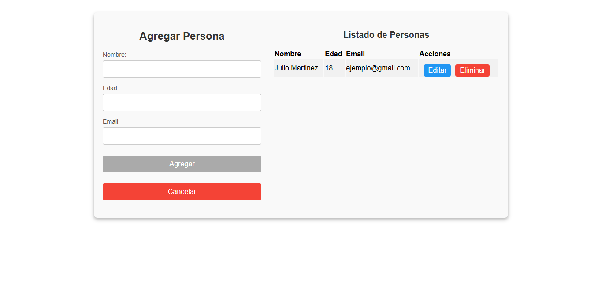

## Listar todos los contenedores existentes

Para ver los contenedores disponibles en Docker, usa el siguiente comando:

```sh
docker ps -a
```

#     Proceso de construcción de los proyectos en Docker


## Proyecto Flask

##### Crear y ejecutar el contenedor de Ubuntu para Flask
```sh
docker run -it -p 5000:5000 --name ubuntu-container ubuntu
```
1. Iniciar el contenedor
```sh
docker start -ai ubuntu-container
```
2. Acceder al contenedor
```sh
docker exec -it ubuntu-container bash
```
3. Actualizar paquetes e instalar dependencias
```sh
apt update && apt upgrade -y
apt update && apt install -y nano
apt install -y python3 python3-pip
```

4. Verificar la instalación de Python y pip
```sh
python3 --version
pip3 --version
```

5. Instalar y configurar entorno virtual
```sh
apt update && apt install -y python3-venv
python3 -m venv venv
```

6. Activar entorno virtual
```sh
source venv/bin/activate
```

7. Instalar dependencias de Python
```sh
pip install flask
pip install requests
```
8. Crear y editar el archivo de la aplicación Flask
Puedes usar código del archivo **`app.py`** de este repositorio
```sh
nano app.py
```

9. Crear la carpeta de plantillas y el archivo HTML
Puedes usar código del archivo **`templates/index.html`** de este repositorio
```sh
mkdir templates
cd templates
nano index.html
```

10. Ejecutar la aplicación Flask
```sh
python app.py
```

11. Acceder a la aplicación en el navegador
```sh
http://localhost:5000/
```

### Resultado esperado:
<p align="center"></p>


## Proyecto Angular

1. Crear y ejecutar el contenedor de Ubuntu para Angular
```sh
docker run -it -p 4200:4200 --name ucontainer-angular ubuntu
```

2. Acceder al contenedor
```sh
docker exec -it ucontainer-angular bash
```

3. Actualizar paquetes e instalar herramientas básicas
```sh
apt update && apt upgrade -y
apt install -y nano curl wget
```

4. Instalar Node.js y npm
```sh
curl -sL https://deb.nodesource.com/setup_16.x | bash -
apt install -y nodejs
```

5. Verificar la instalación de Node.js y npm
```sh
node -v
npm -v
```

6. Instalar Angular CLI, el proyecto utiliza la Version 16 de Angular
```sh
npm install -g @angular/cli@16
ng version
```

### Puedes usar este repositorio que contiene el proyecto Angular.
```sh
git clone https://github.com/mssj-11/crud-personas.git
```

7. Navegar al directorio del proyecto
```sh
cd crud-personas
```

8. Ejecutar el servidor Angular
```sh
ng serve --host 0.0.0.0
```

9. Acceder a la aplicación en el navegador
```sh
http://localhost:4200/
```

### Resultado esperado:
<p align="center"></p>


### ###########################################################################################

`docker start ubuntu-container`

`docker start ucontainer-angular`

Acceder :
`docker exec -it ubuntu-container bash`
`docker exec -it ucontainer-angular bash`


Detener:
`docker stop ubuntu-container`

`docker stop ucontainer-angular`