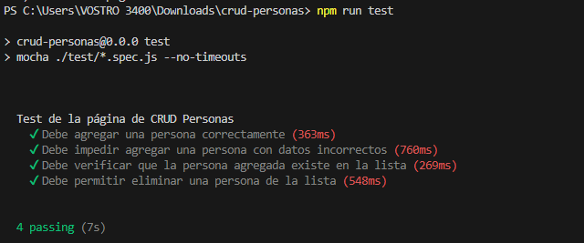

# Iniciar el Contenedor

```sh
docker start -ai ucontainer-angular
```

## Ingresar al contenedor
```sh
docker exec -it ucontainer-angular bash
```

## Ingresar al proyecto de Angular
```sh
cd crud-personas
```

## Instalar dependencias de Selenium y Mocha
```sh
npm i selenium-webdriver assert --save
npm i mocha --save-dev
npm i selenium-webdriver mocha webdriver-manager
```


### Ajustes en el archivo **`package.json`**:
```js
"test": "mocha ./test/*.spec.js --no-timeouts"
```


### Crear las carpetas y archivos para los TEST
```sh
mkdir test
cd test
```

### Archivo test de personas:
```sh
nano persona.spec.js
```

*   Código:
```js
const { expect } = require('chai');
const { getDriver } = require('./testConfig');
const PersonaPage = require('./pages/personaPage');

describe('Test de la página de CRUD Personas', function () {
    let driver;
    let personaPage;

    before(async function () {
        driver = await getDriver();
        personaPage = new PersonaPage(driver);
        await personaPage.open();
    });

    after(async function () {
        await driver.quit();
    });

    it('Debe agregar una persona correctamente', async function () {
        let initialCount = await personaPage.getPersonasCount();
        await personaPage.fillForm("Juan Pérez", 30, "juan@example.com");
        await personaPage.submitForm();
        let newCount = await personaPage.getPersonasCount();
        expect(newCount).to.equal(initialCount + 1);
    });

    it('Debe impedir agregar una persona con datos incorrectos', async function () {
        await personaPage.fillForm("", 17, "correo-invalido");
        await personaPage.submitForm();
        let countAfterInvalid = await personaPage.getPersonasCount();
        expect(countAfterInvalid).to.equal(await personaPage.getPersonasCount());
    });

    it('Debe verificar que la persona agregada existe en la lista', async function () {
        let nombre = "Juan Pérez";
        await personaPage.fillForm(nombre, 30, "juan@example.com");
        await personaPage.submitForm();
        let exists = await personaPage.personaExists(nombre);
        expect(exists).to.be.true;
    });

    it('Debe permitir eliminar una persona de la lista', async function () {
        await personaPage.fillForm("María López", "28", "maria@example.com");
        await personaPage.submitForm();

        let existeAntes = await personaPage.personaExists("María López");
        expect(existeAntes).to.be.true;

        await personaPage.eliminarPersona("María López");

        let existeDespues = await personaPage.personaExists("María López");
        expect(existeDespues).to.be.false;
    });


});
```


### Archivo test de configuración del navegador:
```sh
nano testConfig.js
```

*   Código:
```js
const { Builder } = require("selenium-webdriver");

async function getDriver() {
    let driver = await new Builder().forBrowser("chrome").build();
    return driver;
}

module.exports = { getDriver };
```


Dentro de la carpeta test crear la carpeta **`pages`**
```sh
mkdir pages
cd pages
```

Crear el archivo **`personaPage.js`**:
```sh
nano personaPage.js
```

*   Código:
```js
const { By, until } = require("selenium-webdriver");

class PersonaPage {
    constructor(driver) {
        this.driver = driver;
        this.url = "http://localhost:4200";
        this.nombreInput = By.id("nombre");
        this.edadInput = By.id("edad");
        this.emailInput = By.id("email");
        this.submitButton = By.css("button[type='submit']");
        this.cancelButton = By.xpath("//button[contains(text(),'Cancelar')]");
        this.tableRows = By.css("tbody tr");
    }

    async open() {
        await this.driver.get(this.url);
    }

    async fillForm(nombre, edad, email) {
        await this.driver.findElement(this.nombreInput).sendKeys(nombre);
        await this.driver.findElement(this.edadInput).sendKeys(edad);
        await this.driver.findElement(this.emailInput).sendKeys(email);
    }

    async submitForm() {
        await this.driver.findElement(this.submitButton).click();
    }

    async getPersonasCount() {
        let personas = await this.driver.findElements(this.tableRows);
        return personas.length;
    }

    async personaExists(nombre) {
        let personas = await this.driver.findElements(this.tableRows);
        for (let persona of personas) {
            let nombreText = await persona.findElement(By.css("td:first-child")).getText();
            if (nombreText === nombre) {
                return true;
            }
        }
        return false;
    }


    async eliminarPersona(nombre) {
        let personas = await this.driver.findElements(this.tableRows);
        for (let persona of personas) {
            let nombreText = await persona.findElement(By.css("td:first-child")).getText();
            if (nombreText === nombre) {
                let eliminarBtn = await persona.findElement(By.xpath(".//button[contains(text(),'Eliminar')]"));
                await eliminarBtn.click();

                return true;
            }
        }
        return false;
    }


}

module.exports = PersonaPage;
```


## Resultado
<p align="center"></p>